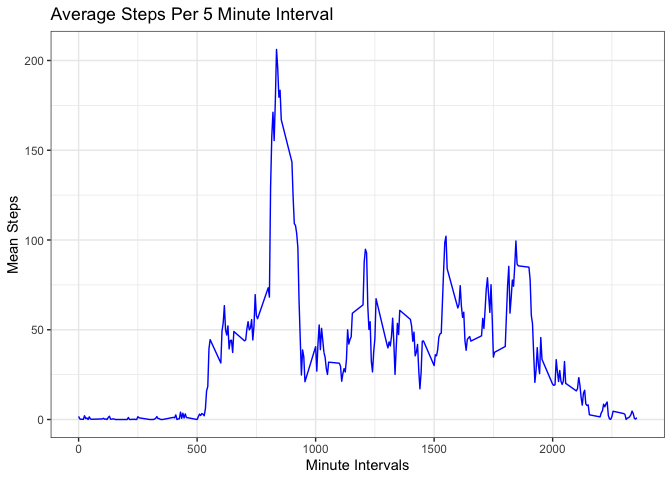
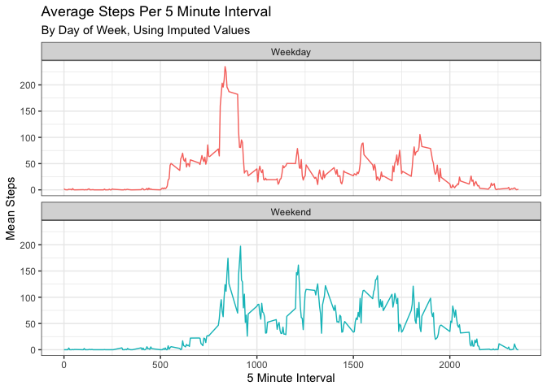

## Loading and preprocessing the data
First we will load in our packages:

```r
library(tidyverse)
```

```
## ── Attaching core tidyverse packages ──────────────────────── tidyverse 2.0.0 ──
## ✔ dplyr     1.1.2     ✔ readr     2.1.4
## ✔ forcats   1.0.0     ✔ stringr   1.5.0
## ✔ ggplot2   3.4.2     ✔ tibble    3.2.1
## ✔ lubridate 1.9.2     ✔ tidyr     1.3.0
## ✔ purrr     1.0.1     
## ── Conflicts ────────────────────────────────────────── tidyverse_conflicts() ──
## ✖ dplyr::filter() masks stats::filter()
## ✖ dplyr::lag()    masks stats::lag()
## ℹ Use the conflicted package (<http://conflicted.r-lib.org/>) to force all conflicts to become errors
```

```r
library(magrittr)
```

```
## 
## Attaching package: 'magrittr'
## 
## The following object is masked from 'package:purrr':
## 
##     set_names
## 
## The following object is masked from 'package:tidyr':
## 
##     extract
```
Then, set the working directory, and load in our data as a dataframe named **df**. 
Additionally, we will also convert the date variable from character to date format:

```r
setwd("~/Desktop")
df <- read.csv("activity.csv")
df %<>% mutate(date = as.Date(date))
```

## What is mean total number of steps taken per day?
First we will create a new subset of the dataframe named **total_steps** which groups the data by the date, then creates a summary column of the total amount of steps:

```r
total_steps <- df %>% group_by(date) %>% summarise(total_steps = sum(steps, na.rm = T))
```
Using this new table, we can feed it into ggplot and create our graph:

```r
total_steps %>% ggplot(aes(x = date, y = total_steps)) +
                geom_histogram(stat = "identity", fill = "darkorange") +
                labs(x = "Date",
                     y = "Steps",
                     title = "Total Steps Per Day") +
                theme_bw()
```

<!-- -->

We then calculate the mean and median of the total steps:

```r
mean(total_steps$total_steps)
```

```
## [1] 9354.23
```

```r
median(total_steps$total_steps)
```

```
## [1] 10395
```

## What is the average daily activity pattern?
Similar to the last question, we will create another sub-table named **daily** , this time calculating the average steps for each 5 minute interval across all days:

```r
daily <- aggregate(steps ~ interval, df, mean, na.rm = T) %>% rename(avg_steps = steps)
```

Feeding the **daily** dataframe into ggplot and creating our graph:

```r
daily %>% ggplot(aes(x = interval, y = avg_steps)) +
          geom_line(color = "blue") +
          labs(x = "Minute Intervals",
               y = "Mean Steps",
               title = "Average Steps Per 5 Minute Interval") +
          theme_bw()
```

<!-- -->

We can then find which interval has the highest average steps:

```r
daily$interval[which.max(daily$avg_steps)]
```

```
## [1] 835
```

## Imputing missing values
Now on to dealing with missing values. First we will run a simple command to check how many missing values we have in the *steps* variable:

```r
sum(is.na(df$steps))
```

```
## [1] 2304
```

For this assignment, I decided to use the MICE (Multiple Imputation by Chained Equations) imputation method using the mice() function from the mice package. Specifically, I will be using the CART predictive algorithm as denoted by the *method* argument. First we load in the package and set the seed to any arbitrary number. From there, we create a new dataset named **imputed_df** which is a result of taking our original **df** dataframe and running the complete() function to populate the *steps* variable with the new imputed values from the CART algorithm:

```r
library(mice)
```

```
## 
## Attaching package: 'mice'
```

```
## The following object is masked from 'package:stats':
## 
##     filter
```

```
## The following objects are masked from 'package:base':
## 
##     cbind, rbind
```

```r
set.seed(1)
imputed_df <- df %>% mutate(steps = complete(mice(df, method = "cart"))$steps)
```

```
## 
##  iter imp variable
##   1   1  steps
##   1   2  steps
##   1   3  steps
##   1   4  steps
##   1   5  steps
##   2   1  steps
##   2   2  steps
##   2   3  steps
##   2   4  steps
##   2   5  steps
##   3   1  steps
##   3   2  steps
##   3   3  steps
##   3   4  steps
##   3   5  steps
##   4   1  steps
##   4   2  steps
##   4   3  steps
##   4   4  steps
##   4   5  steps
##   5   1  steps
##   5   2  steps
##   5   3  steps
##   5   4  steps
##   5   5  steps
```

We can then recreate the sub-table that we used to answer the first question, but this time with the new imputed values dataframe, **imputed_df**. We will assign this to an object named **total_steps_imputed**:

```r
total_steps_imputed <- imputed_df %>% group_by(date) %>% summarise(total_steps = sum(steps, na.rm = T))
```

We can then use this table to create our ggplot graph:

```r
total_steps_imputed %>% ggplot(aes(x = date, y = total_steps)) +
                        geom_histogram(stat = "identity", fill = "darkred") +
                        labs(x = "Date",
                             y = "Steps",
                             title = "Total Steps Per Day",
                             subtitle = "Using Imputed Values") +
                        theme_bw()
```

<!-- -->

Then recalculating the mean and median of the new imputed dataframe:

```r
mean(total_steps_imputed$total_steps)
```

```
## [1] 10408.15
```

```r
median(total_steps_imputed$total_steps)
```

```
## [1] 10600
```

## Are there differences in activity patterns between weekdays and weekends?
To answer this question, we have to create a new variable named *day* that assigns either the value "Weekday" or "Weekend" depending on what day of the week it is. We can accomplish this by using the case_when() and weekdays() functions and assign the resulting dataframe to a new object named **weekdays**:

```r
weekdays <- imputed_df %>% mutate(day = case_when(weekdays(date) == "Monday" ~ "Weekday",
                                                  weekdays(date) == "Tuesday" ~ "Weekday",
                                                  weekdays(date) == "Wednesday" ~ "Weekday",
                                                  weekdays(date) == "Thursday" ~ "Weekday",
                                                  weekdays(date) == "Friday" ~ "Weekday",
                                                  weekdays(date) == "Saturday" ~ "Weekend",
                                                  weekdays(date) == "Sunday" ~ "Weekend"))
```

Converting the new variable to a factor with two levels (will aid in graphing):

```r
weekdays$day <- factor(weekdays$day, levels = c("Weekday", "Weekend"))
```

We can then recreate the aggregate sub-table from question 2 (using the new **weekdays** dataframe), but this time grouping on both the interval *AND* day variables. The result will be assigned to a new object named **daily_weekdays**:

```r
daily_weekdays <- aggregate(steps ~ interval + day, weekdays, mean, na.rm = T) %>% 
                  rename(avg_steps = steps)
```

Finally, we can feed the **daily_weekdays** dataframe into ggplot to graph the average steps between weekdays and weekends:

```r
daily_weekdays %>% ggplot(aes(x = interval, y = avg_steps, color = day)) +
                   geom_line() +
                   facet_wrap(~day, dir = "v") +
                   labs(x = "5 Minute Interval",
                        y = "Mean Steps",
                        title = "Average Steps Per 5 Minute Interval",
                        subtitle = "By Day of Week, Using Imputed Values",
                        color = "") +
                   guides(color = FALSE) +
                   theme_bw()
```

<!-- -->


